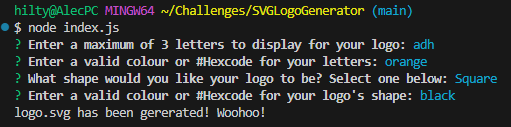

# SVGLogoGenerator

Challenge 10: SVG Logo Maker

This is an application that can be used to generate an SVG Logo. The application uses inquirer and jest and runs in the command line.

The application can be invoked using the command "node index.js"

Repo: https://github.com/hiltyalec/SVGLogoGenerator

Video: https://www.youtube.com/watch?v=JmST4leaxXY